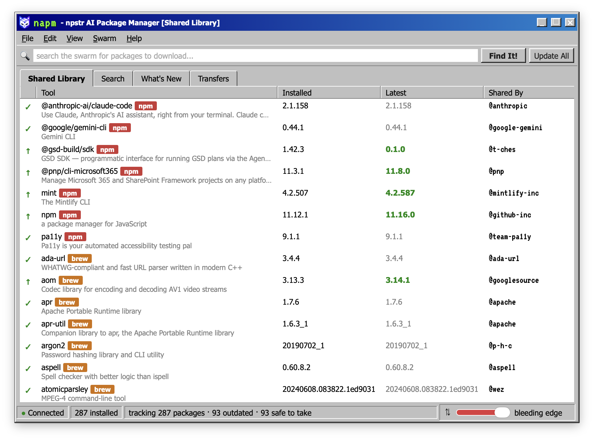
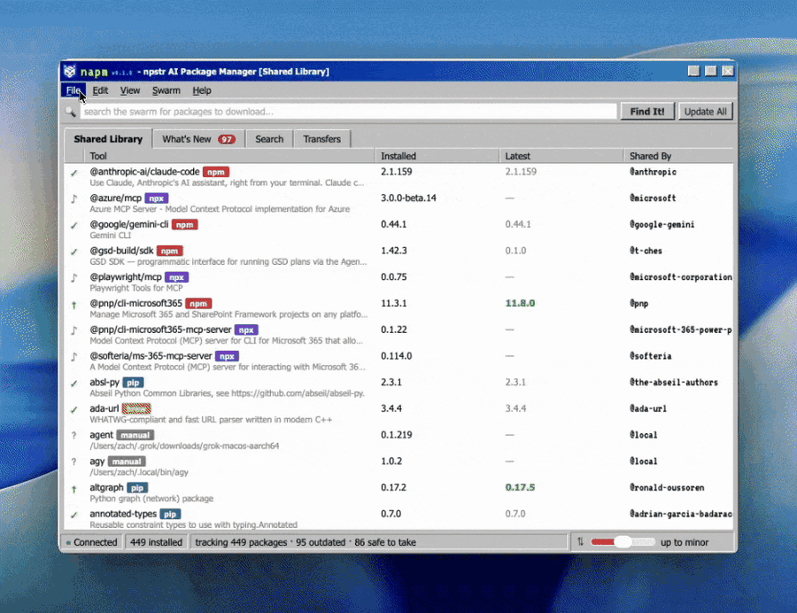
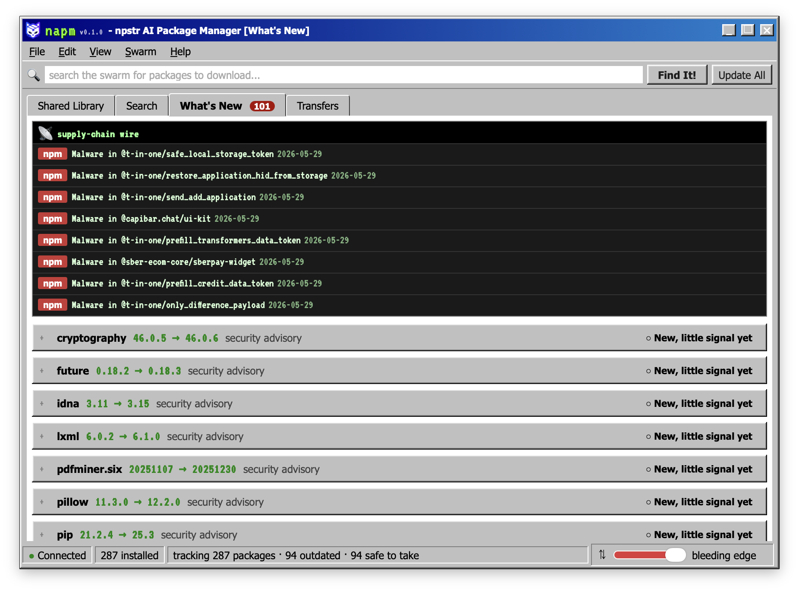
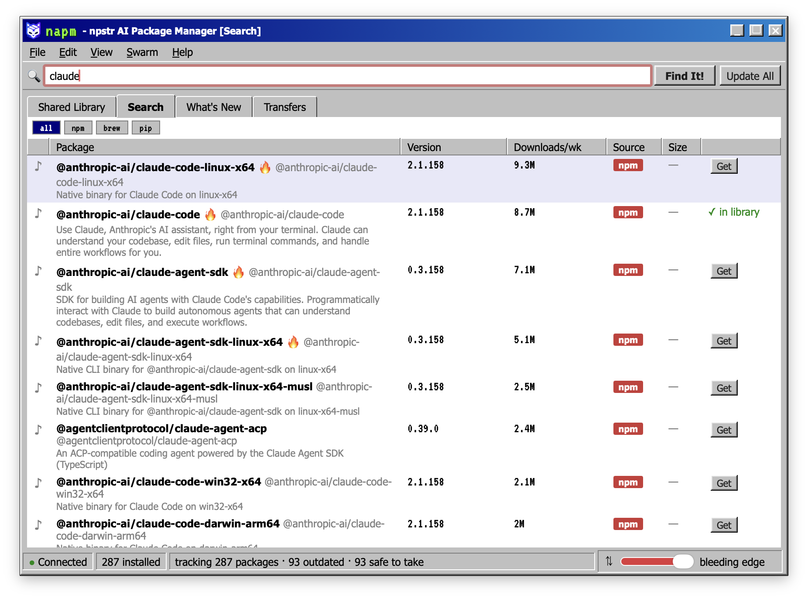
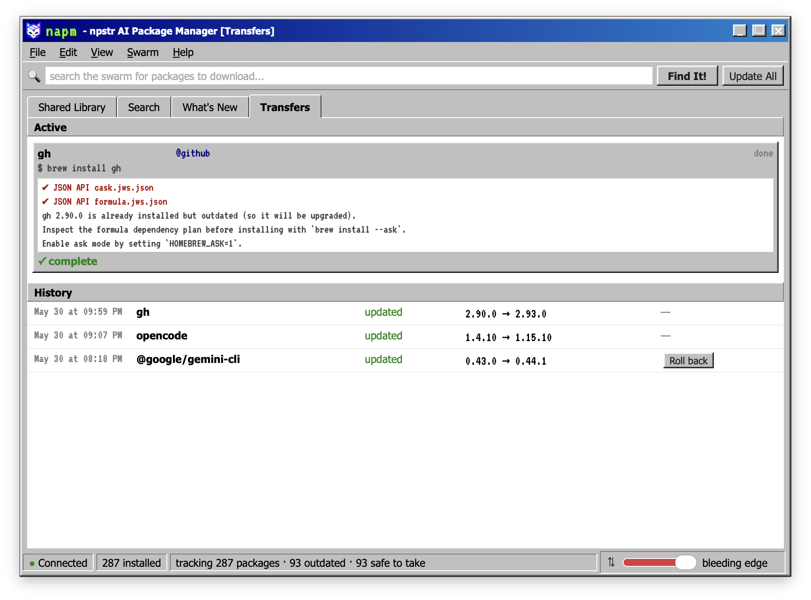
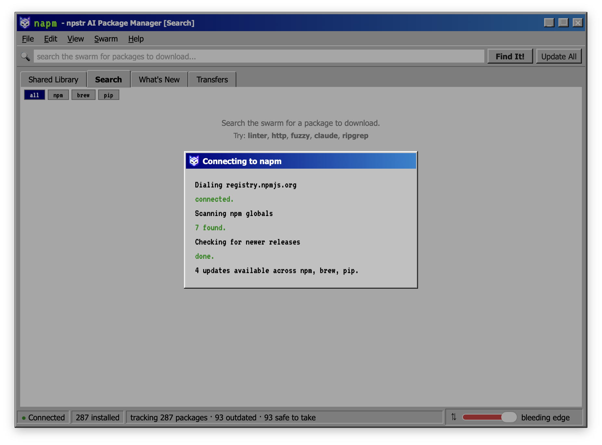

<p align="center">
  
</p>

<p align="center">
  
</p>

<p align="center">
  <strong>napm is the npstr AI Package Manager: the desktop package manager that thinks it is a 1999 file-sharing client.</strong><br/>
  Track and update every command-line dev tool you have across npm, Homebrew, pip, npx, and manual installs, in one place. See what is outdated, whether the update is safe to take, whether anything you are holding is compromised, and roll back when an update goes wrong.<br/><br/>
  Your CLIs are the files. The registry is the swarm. Updating is a download.
</p>

<p align="center">
  <a href="#why">Why</a> ·
  <a href="#features">Features</a> ·
  <a href="#install">Install</a> ·
  <a href="#architecture">Architecture</a> ·
  <a href="#design-decisions">Design Decisions</a>
</p>

<p align="center">
  
  
  
  
  
</p>

<p align="center">
  
</p>

---

## Why

Every developer accumulates a drawer of command-line tools: a dozen npm globals, a hundred Homebrew formulae, pip utilities, the occasional `npx` one-off, and a few things a `curl | bash` script dropped on your PATH. Nothing tracks them as one set. `npm outdated`, `brew outdated`, and `pip list --outdated` each answer for their own corner, none of them tell you whether an update is safe to take, and not one of them can answer the question you actually have at 2am: "this tool started misbehaving, what changed and when."

napm is that single view. It scans every ecosystem you use, tells you what is current, outdated, or unmanaged, scores whether each update is safe to take, scans everything you have installed against a live vulnerability database, and logs every version change so a regression has a paper trail. Then it wears all of that as a late-90s peer-to-peer file-sharing client, because the metaphor is exact: your installed tools are a Shared Library, a newer release is a peer with a better copy, taking an update is a download, and the heavily-downloaded package is the safe grab with a flame next to it.

Everything underneath is real: real scans, real publishers, real on-disk sizes, real security advisories, real install and rollback commands with real streamed output and honest exit codes. There is no fake data and no decorative widget that does nothing.

---

## Features

### Shared Library (the installed view)
- **Five sources, one view**: npm, Homebrew, pip, and npx scanned with one batch command each, plus a best-effort **manual / unmanaged** source that sweeps `$PATH` for tools no package manager owns (the `curl | bash` installs)
- **Honest status** per tool: current, update available, offline, or unmanaged, with a glyph and a real installed-vs-latest comparison that never flags a downgrade as an update
- **Real metadata, every column**: the **Shared By** handle is the package's actual publisher (from offline metadata), **Size** is the real on-disk footprint, **Updated** is when the tool last changed on disk, and each row carries its real one-line description
- **Update Appetite dial**: the old throttle slider, made real. Set how big a version jump counts as safe (patch only, up to minor, or bleeding edge), computed from semver distance. It re-classifies the library live and scopes Update All
- **Pins**: freeze a tool's version so Update All skips it, while it still shows as outdated so you never lose track
- **npx as a first-class source**: tools you have run via `npx` appear with their cached version
- **View controls**: filter to only tools you installed (hides Homebrew dependencies), only outdated, or by source; sort by name, size, updated, or status

### What's New (the decision feed)
- **Protect what you have**: one batched OSV query over every installed tool at its current version flags `malicious` (supply-chain hijacks, from OpenSSF malicious-packages and GitHub malware data) and `vulnerable` (CVE / GHSA), regardless of the appetite dial. A truncated or failed lookup is treated as a failed check, never a clean result
- **The supply-chain wire**: a bulletin strip fed by recent npm and pip malware advisories, so big ecosystem events surface even for packages you do not have
- **Update verdicts**: `safe` for settled releases past an age threshold with no advisories, or "new, little signal yet" for a fresh release rather than a confident guess. Changelogs load on demand from the upstream GitHub releases
- **Honest by construction**: napm never implies "safe" when a check could not run. Homebrew is excluded from the OSV scan (no Homebrew ecosystem) and labeled, not shown as clean. A malicious package with no fix shows a copyable remove command, not a fake one-click

### Search the swarm (registry discovery)
- **Federated** across npm and the Homebrew catalog by default, with source-filter chips to scope to one registry
- **Weekly downloads** shown as the popularity and trust signal, with a flame marker on heavily-shared packages, sorted so the safe grab is on top
- **Honest about pip**: PyPI removed its search API, so pip is exact-name lookup only, labeled as such. napm does not present fuzzy pip search that returns nothing
- Installing from a result runs the same real Transfers path as everything else

### Transfers (execution, history, rollback)
- **Real install, update, and rollback** commands with stdout and stderr streamed live into the active row, and success or failure shown from the actual exit code, not a fake progress bar
- **Persistent history** of every install, update, and rollback with a timestamp and a from/to, so "what changed and when" is answerable
- **Rollback** for npm (`npm i -g pkg@ver`) and pip (`pip install pkg==ver`). Homebrew is gated honestly, since it keeps no old bottles and cannot reliably downgrade

### Throughout
- **Menu bar** (File / Edit / View / Swarm / Help): rescan, open the data folder, refresh registry caches, About, and the persisted View filters above
- **Right-click context menus** on every meaningful row, with only the actions that apply (inapplicable ones greyed with a reason, never faked)
- **Preferences**: a GitHub token (raises the API rate limit for changelogs and the wire) and per-source enable / disable toggles, persisted
- **Export library** to JSON or Markdown

### Packaging and updates
- A **signed and notarized** macOS `.dmg` that opens cleanly with no Gatekeeper warning
- An **in-app auto-updater** that checks on launch and offers the update, plus a manual check in the Help menu. Updates are minisign-signed and verified before they install
- A **login-shell PATH capture** at startup so a Dock-launched app finds `npm`, `brew`, `pip`, and your manual tools, which a GUI app otherwise cannot

### Aesthetic (real underneath)
- Windows-98 beveled chrome and a VT323 wordmark
- A dial-up connect splash on launch that covers the first real scan
- The npstr mark: a cat with a shipping box for a head, because a package manager should look like the package

---

## What napm sends

To check your tools, napm sends package names and versions to OSV.dev for the advisory scan, registry.npmjs.org and pypi.org for versions and changelogs, formulae.brew.sh for the brew catalog, crates.io for cargo versions and changelogs, and api.github.com for release notes and the supply-chain wire, with your token if you set one. Nothing else leaves your machine, and nothing is sent anywhere else.

The advisory scan is the one that matters most to call out: on every launch it batches your entire installed-package inventory, every name and exact version, to OSV.dev over TLS. That is inherent to the feature, not a bug, but it is still a fingerprint of your machine leaving by default with no prompt. If you would rather not send it, turn off "Scan installed tools against the OSV advisory database" in Preferences. Turning it off does not mean your tools are safe, it means napm did not check, and the What's New feed says so plainly instead of showing a false all-clear.

---

## See It In Action

**The menu bar and View filters** in motion: rescan, scope the library by source, sort, and toggle what shows:

<p align="center">
  
</p>

**What's New** scores every available update so you know whether to take it, and flags anything you have installed that is compromised:

<p align="center">
  
</p>

**Search the swarm** hits the registries, sorted by weekly downloads as the trust signal, with a flame on the heavily-shared grabs:

<p align="center">
  
</p>

**Transfers** is where versions actually change: real streamed install output and an honest exit code, with a rollback-able history:

<p align="center">
  
</p>

And the dial-up splash on launch, covering the first real scan:

<p align="center">
  
</p>

---

## Tech Stack

| Layer | Technology |
|-------|-----------|
| **Shell** | Tauri v2 (Rust), a single native macOS window, no Node runtime shipped |
| **Backend** | Native Rust Tauri commands: `scan`, `search`, `intel`, `ops`, `store`, `pathenv` |
| **Frontend** | A single vanilla HTML / CSS / JS file (`frontend/index.html`) calling `invoke()` |
| **Package sources** | npm, Homebrew, pip, npx via `std::process::Command`; manual installs via a `$PATH` sweep |
| **Security intel** | OSV.dev (batched advisory scan), OpenSSF malicious-packages, GitHub global advisories |
| **Network** | One process-wide keep-alive `ureq` agent to the npm registry, formulae.brew.sh, PyPI, GitHub, and OSV, cached aggressively in the app-data dir |
| **Persistence** | Flat JSON in the platform app-data directory (`pins.json`, `history.json`, `settings.json`) plus tiered registry / advisory caches |
| **Updates** | Tauri updater plugin, minisign-signed artifacts published on GitHub Releases |
| **Signing** | Developer ID Application signature plus Apple notarization |
| **Platform** | macOS, Apple silicon first |

---

## Architecture

Two layers. A native Rust backend owns every shell call, version comparison, and status classification, and is the single source of truth. A vanilla-JS frontend is the Win98 UI and only ever calls `invoke()`; the frontend's only version-adjacent logic is the appetite dial's safe/held mapping over the backend-computed bump kind.

```
              +-----------------------------------+
              |     Tauri WebView (frontend)      |
              |   Win98 chrome, one vanilla-JS    |
              |   file, no shell access           |
              +------------------+----------------+
                                 |  invoke()
              +------------------+----------------+
              |        Rust backend (Tauri)       |
              |  scan · search · intel · ops ·    |
              |  store · pathenv                  |
              +------------------+----------------+
            std::process::Command         shared keep-alive HTTP
        +--------+--------+--------+----+   +-----------------------+
        |  npm   |  brew  |  pip   | npx|   | npm registry · PyPI · |
        +--------+--------+--------+----+   | formulae.brew.sh ·    |
        |     manual ($PATH sweep)     |   | GitHub · OSV.dev      |
        +------------------------------+   +-----------------------+
                                 |
                       +---------+---------+        +------------------+
                       |  JSON app-data    |        |  GitHub Releases |
                       |  pins / history / |        |  signed updates  |
                       |  settings + caches|        |  + latest.json   |
                       +-------------------+        +------------------+
```

---

## Install

### Download (recommended)

Grab the signed, notarized `.dmg` from the [latest release](https://github.com/umzcio/napm/releases/latest), open it, and drag **napm** to Applications. It opens with no Gatekeeper warning and keeps itself up to date from then on.

### Updating

napm updates itself. On launch, once the library finishes scanning, it quietly checks the release feed. If a newer signed version exists, a beveled "Update available" prompt appears with the release notes and an Update now / Later choice. Choosing Update now downloads the verified build, installs it, and relaunches. You can also trigger a check any time from **Help -> Check for updates**. Every update is signature-verified against a key baked into the app, so a tampered download is rejected rather than installed.

### Build from source

**Prerequisites**
- [Rust](https://rustup.rs) (stable) and the [Tauri v2 system setup](https://v2.tauri.app/start/prerequisites/)
- Node 18+ and npm
- macOS (the only supported target today)

```bash
git clone https://github.com/umzcio/napm.git
cd napm

# install the Tauri CLI and dev tooling
npm install

# build the Rust backend and launch the app
npm run tauri dev

# or build a release bundle (.app + .dmg)
npm run tauri build
```

The first launch compiles the Rust backend, so give it a minute. After that the dial-up splash plays while your real installed tools fill the Shared Library.

### Releasing (maintainers)

Releases are cut locally. `scripts/release.sh` sources `scripts/.notary-config.local` (a gitignored copy of `scripts/.notary-config.example`) for the Apple Developer ID identity, the App Store Connect API key, and the updater signing key, then runs `npm run tauri build`. Tauri signs, notarizes, staples, and emits the `.dmg` plus the updater artifacts (`napm.app.tar.gz` and its `.sig`) in one pass. `scripts/make-latest-json.sh <version> <tag> "notes"` assembles `latest.json` from the build's signature so the manifest is never hand-edited. Upload the `.dmg`, `napm.app.tar.gz`, and `latest.json` to a GitHub release; the updater endpoint always reads the newest published release.

The Apple `.p8` key, `scripts/.notary-config.local`, and the updater private key are never committed. The updater public key in `tauri.conf.json` is safe to commit, since it only verifies.

---

## Project Structure

```
napm/
├── frontend/
│   ├── index.html              # the whole UI: Win98 chrome + vanilla JS
│   ├── npstr-logo.svg
│   └── vt323.ttf               # bundled font (no CDN at runtime)
├── src-tauri/                  # native Rust backend
│   ├── src/
│   │   ├── lib.rs              # Tauri commands (scan_installed, run_op, ...)
│   │   ├── pathenv.rs          # login-shell PATH capture at startup
│   │   ├── http.rs             # one shared keep-alive HTTP agent
│   │   ├── store.rs            # JSON store: pins / history / settings
│   │   ├── ops.rs              # streamed install / update / rollback
│   │   ├── scan/               # one module per source (npm/brew/pip/npx/manual)
│   │   ├── search/             # federated registry search
│   │   └── intel/              # OSV scan, supply-chain wire, release verdicts
│   ├── icons/                  # generated from assets/npstr-logo.svg
│   └── tauri.conf.json
├── scripts/                    # signed-release + notarization helpers
├── reference/scanner.js        # the original CLI, kept as a logic reference
├── assets/npstr-logo.svg       # brand source
└── docs/                       # the living roadmap and media
```

---

## Design Decisions

**Why a 90s file-sharing skin?** Nostalgia, honestly. I wanted to recreate that late-90s peer-to-peer feel. It also turns out to be a near-perfect metaphor: a P2P client is a list of files, who has them, which copies are newer, and a queue of transfers. Swap "files" for "CLI tools" and you have a package manager. So the look is genuine homage, and every element that reads as flavor still carries real data underneath.

**Why Tauri and native Rust?** napm needs privileged shell access to run npm, brew, and pip, which rules out a pure browser app. Tauri gives a tiny single-binary native window, and keeping every shell call, version comparison, and status classification in Rust means there is exactly one source of truth and the frontend can never shell out.

**Why capture the login-shell PATH at startup?** A GUI app launched from the Dock does not inherit your shell PATH, it gets a bare `/usr/bin:/bin:/usr/sbin:/sbin`. Without capturing the real PATH first, a packaged napm would find none of your tools. It runs your login shell once at startup, reads its PATH, and sets it before anything spawns.

**Why scan everything for advisories, not just outdated tools?** A vulnerability in the version you are holding matters whether or not a newer one exists. The OSV scan runs over your entire installed set at its current versions, so "is anything I have compromised" is answered independently of "what can I update."

**Why classify severity from the advisory id instead of fetching details up front?** Speed. The malicious-versus-vulnerable call comes from the OSV id prefix, so the feed loads fast over a hundred-plus packages; the full advisory detail loads lazily when you expand a card.

**Why downloads-per-week as the trust signal?** In a registry the heavily downloaded package is usually the safe grab. Sorting search by popularity turns a vanity metric into a recommendation, and the flame marker makes the loud signal visible.

**Why be honest about pip, brew, and manual installs?** PyPI has no search API, Homebrew keeps no old bottles, and manual installs have no registry or uniform updater. Pretending otherwise would mean fuzzy pip search that returns nothing, a rollback button that always fails, and a fake update path for tools that have none. napm surfaces each limit in the UI instead of papering over it.

**Why a real publisher in "Shared By" instead of fake peer handles?** Early mockups used invented peer names for flavor. The rule the project settled on is that every element is real, so the column shows the package's actual publisher, derived from offline metadata. The joke is the interface, not the information.

**Why flat JSON instead of SQLite?** The persisted data is small: a set of pins, a history log, and a settings object. A few JSON files in the app-data directory are simpler, inspectable, and trivially debuggable, with no schema migrations to run.

---

## Naming and legal

napm stands for **n**pstr **A**I **P**ackage **M**anager. The late-90s file-sharing styling is homage and parody. The original brand name is never used, and none of its logo or trade dress is reproduced. napm's mark is its own original artwork, a cat with a shipping box for a head. Homage, not affiliation.

## Contributing

Issues and pull requests are welcome. See [CONTRIBUTING.md](CONTRIBUTING.md) for how to set up a local build, the project conventions, and how to report a security issue responsibly.

## License

[MIT](LICENSE). Use it, fork it, keep the era flavor.

---

<p align="center">
  <em>Connected at 56.6 kbps. The swarm is large, and the throttle finally does something.</em><br/>
  <sub>npstr AI Package Manager. Your tools, shared.</sub>
</p>
